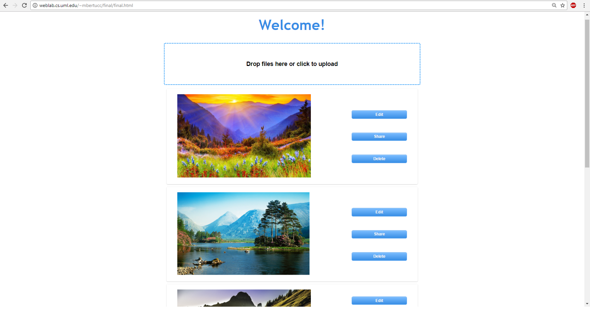

## GUI I Fall 2017 Final Project

# Description

The project was to develop a personal page to display a gallery of photos/images 
(this is the professor's project idea). I based my approach on the criteria in the 
assignment description. I tried to find libraries that would help with some of the
more complicated features, like a a list that can be reorganized by dragging and 
dropping (I used Muuri), a way to upload images to a server via file dialog and
dragging/dropping (I used DropzoneJS), and a way to perform image processing
(I found CamanJS after failed attemps with other libraries like Jimp and fabricjs).

I did not copy any code wholesale from another source.

Parts of the code that were modified from elsewhere:

1. Code for constructing the Muuri object (the drag-n-drop grid) was 
   modified from their demo at https://haltu.github.io/muuri/

2. The sorting algorithm used for restoring the saved order or the grid
   items upon page load was modified from georg's answer on
   https://stackoverflow.com/questions/13304543/javascript-sort-array-based-on-another-array

3. The html template and basic structure of the function to create and control the 
   image editing dialog were modified from the tutorial at
   https://code.tutsplus.com/tutorials/build-a-canvas-image-editor-with-canvas--net-18143
   
   ### NOTE!
   I could not get the actual image editing to work. I tried several different
   libraries and each attempt yielded errors that I was unable to resolve. 
   
   I finally stumbled upon CamanJS which I was able to make use of for some of 
   the operations, like brightness and cropping, but by that point I didn't have time
   to build all the controls for the user to change those values, so I hardcoded 
   some values just to demonstrate the functionality.

# User Manual

Start the app by visiting the web page at:
  http://weblab.cs.uml.edu/~mbertucc/final/final.html

1. Click on the upload area to open the file selection dialog to select an image file.
   Alternatively, you can drag and drop a file into the upload area.

   The upload area will show the progress of each image as it uploads to the server.
   After a new image has finished uploading, its thumbnail will disappear from the upload area and
   the image will be automatically added to the gallery list (it is added at the bottom, so you may
   need to scroll down to see it if there are already several images in the gallery).

   If the image failed to upload (for instance, if the file size exceeded the limit), it will remain
   in the upload area to display the error. Refreshing the page will clear it from the view.

2. You can drag the gallery items to reorder them. The order will be remembered and restored to how you
   left it when you reload the page.

3. The gallery items present scaled-down views of each image. Click on an image to view the full sized
   image on the screen.

4. Clicking the 'Delete' button will delete the image from the gallery and remove the 
   file from the server.

5. Clicking the 'Share' button will allow you to post the image to Facebook, and will also provide a
   direct hyperlink to the image on the server.

6. Clicking the 'Edit' button is will to allow you to manipulate the image in various ways 
   and save the changes (or is supposed to - see below).
   
   However, due to production difficulties several of these features are broken or limited in 
   their functionality.
   At the time of writing this,
     - Converting the image to grayscale works like a charm
     - Changing the brightness, contrast, and cropping the image essentially perform demos of their
       functions but I was unable to implement the full controls.
     - I could not get the save or rotate features to work at all.

And that concludes this user manual. Overall the app is pretty simple and easy to use.

